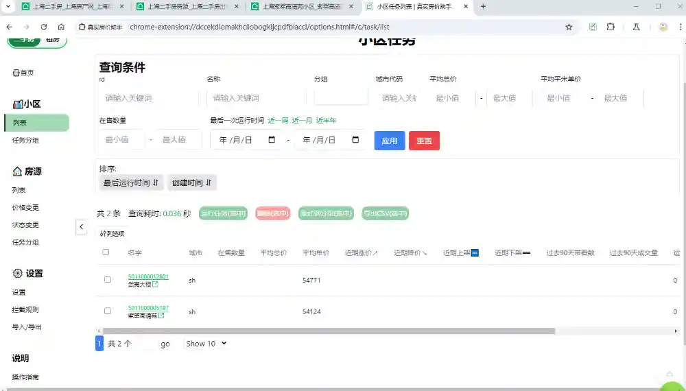

# 真实房价助手

这是一款浏览器插件(Chrome 内核, Chrome, Edge, ...), 帮助正在关注二手房市场的购房者/租房者:

1. 信息收集: 自动化一键收集记录(链家平台)关注范围内的小区/房源状态, 挂牌价
2. 数据记录: 记录入浏览器 IndexedDB 数据库
3. 数据管理: 查看, 筛选, 可视化数据

所有的运行过程和数据都在浏览器内

## 截图

**首页**

**数据列表**

**小区页面**

**数据可视化**

**运行任务**

## 安装

### 1. 应用市场

> 📍 推荐, 安全, 可以自动更新

[Chrome 应用商店](https://chromewebstore.google.com/detail/%E7%9C%9F%E5%AE%9E%E6%88%BF%E4%BB%B7%E5%8A%A9%E6%89%8B/diicflfbkaepgocandilafemlkndjcng)

[Edge 应用商店](https://microsoftedge.microsoft.com/addons/detail/%E7%9C%9F%E5%AE%9E%E6%88%BF%E4%BB%B7%E5%8A%A9%E6%89%8B/emapefokhkiilhadifnkpcoclidgkolp)

### 2. 手动安装

[Github Releases](https://github.com/slow-groovin/house-price-record-ext/releases)

[第三方平台](https://www.crxsoso.com/webstore/detail/diicflfbkaepgocandilafemlkndjcng)

## 使用介绍

请打开插件后台查看
